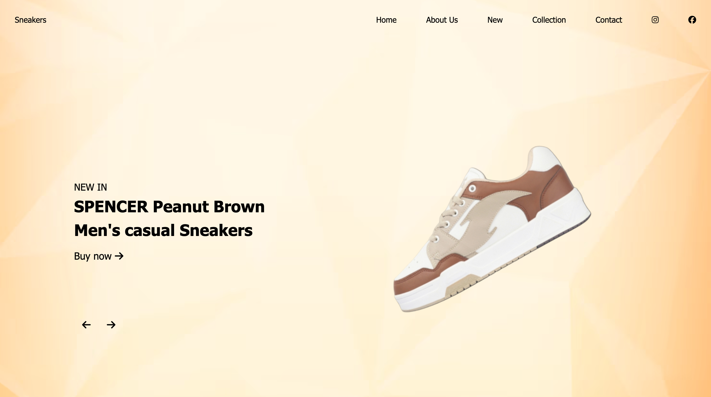

# Landing Page

A responsive landing page built with modern web technologies to provide an engaging and seamless user experience across all devices.

## Features
- Fully responsive design for desktop, tablet, and mobile
- Modern and visually appealing UI/UX
- Clean and maintainable code structure
- Optimized for performance and SEO

## Technologies Used
- HTML5
- CSS3 (Flexbox & Grid)

## Installation
1. Clone the repository:
   ```sh
   git clone https://github.com/sabbanimanideep/CODSOFT.git
   ```
2. Navigate to the project directory:
   ```sh
   cd CODSOFT
   ```
3. Open the `index.html` file in your browser or use a local server.

## Usage
- Modify the content and images in the `index.html` file as needed.
- Customize the styles in `style.css`.

## Screenshots
Desktop View

Mobile view


## Contributing
Feel free to fork this repository and submit pull requests with improvements or bug fixes.

## License
This project is licensed under the MIT License.

